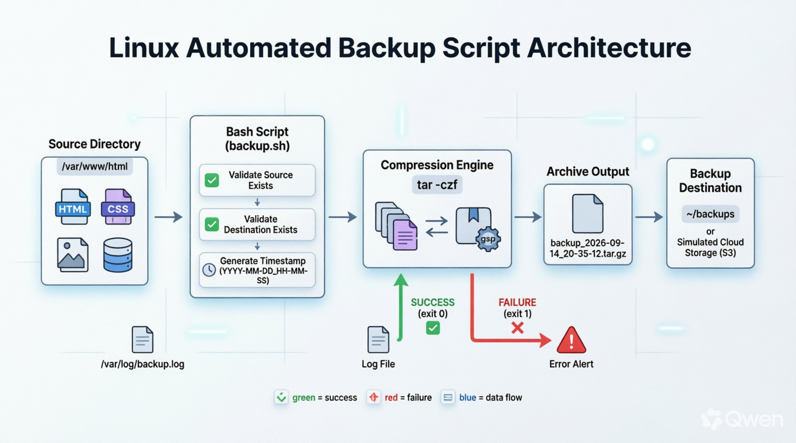

## Project 1: Automated Backup Script

Part of the Simple Linux Projects for Cloud Engineers series. A Bash script that compresses a target directory into a timestamped .tar.gz archive, built and documented around the permission model of real production systems — privileged provisioning, unprivileged execution, and failure-aware exit codes — rather than a simplified home-directory tutorial.

## What this project does
- **Takes a source directory (in this project, the production-style path /var/www/html)
- **Validates that the source and backup destination exist before doing anything
- **Produces a compressed, timestamped .tar.gz archive
- **Reports success or failure in plain language and exits with a meaningful exit code (0 on success, 1 on failure) — the signal cron and monitoring systems rely on.


## Architecture



Data flows from the privileged source directory (owned by `root`), through the script running as an unprivileged user, into a timestamped archive it owns outright. The two terminal states — validation/`tar` failure vs. a verified archive — map directly to exit codes `1` and `0`.


## What this project does

| # | Project | Status | Live Page | Skills |
|---|---------|--------|-----------|--------|
| 1 | [Automated Backup Script](index.html) | ✅ Complete | 🔗 **[View Live](https://elixirman.github.io/linux-cloud-project1-Automated-backup-)** | `tar`, `gzip`, variables, exit codes, permissions |
| 2 | Cron Job Automation | 🔜 Planned | — | Crontab syntax, scheduling, background execution logs |
| 3 | Log Monitoring and Parsing Tool | 🔜 Planned | — | `grep`, `awk`, `sed`, text filtering |
| 4 | Nginx Web Server Hardening | 🔜 Planned | — | `ufw`, SSH hardening, package management |
| 5 | Custom Systemd Service | 🔜 Planned | — | `.service` files, `journalctl`, process management |


| File / folder | Purpose |
|---|---|
| [`backup.sh`](backup.sh) | The backup script itself |
| [`backups/`](backups) | Sample output — archives produced by running the script |
| [`index.html`](index.html) | The full write-up: overview, the production permission model, script walkthrough, architecture, security considerations, and extension exercises |
| [`Schema.png`](Schema.png) | Architecture diagram of the backup flow |
| [`.gitignore`](.gitignore) | Excludes local/system files (secrets and sensitive dotfiles are never committed) |
| [`LICENSE`](LICENSE) | MIT |


## Running it

```bash
chmod +x backup.sh
./backup.sh
```

Expected output on success:

```
Starting backup of '/var/www/html'...
SUCCESS: Backup created at '/home/<user>/backups/backup_<timestamp>.tar.gz'
```

Verify the archive without extracting it:

```bash
tar -tzf backups/backup_*.tar.gz
```

## Approach

- **Privileged provisioning, unprivileged execution.** The source directory is created and owned by `root`; the script itself runs as an ordinary user with only the read access it needs.
- **Failure-aware by default.** Every step validates its inputs and exits nonzero on failure rather than failing silently.
- **Security as a first-class concern.** The write-up (`index.html`) calls out real anti-patterns encountered along the way, including handling of a plaintext credential in the sample source data.

For the full explanation of every line of the script and the reasoning behind each design choice, see [`index.html`](index.html).

## License

MIT — see [LICENSE](LICENSE).
